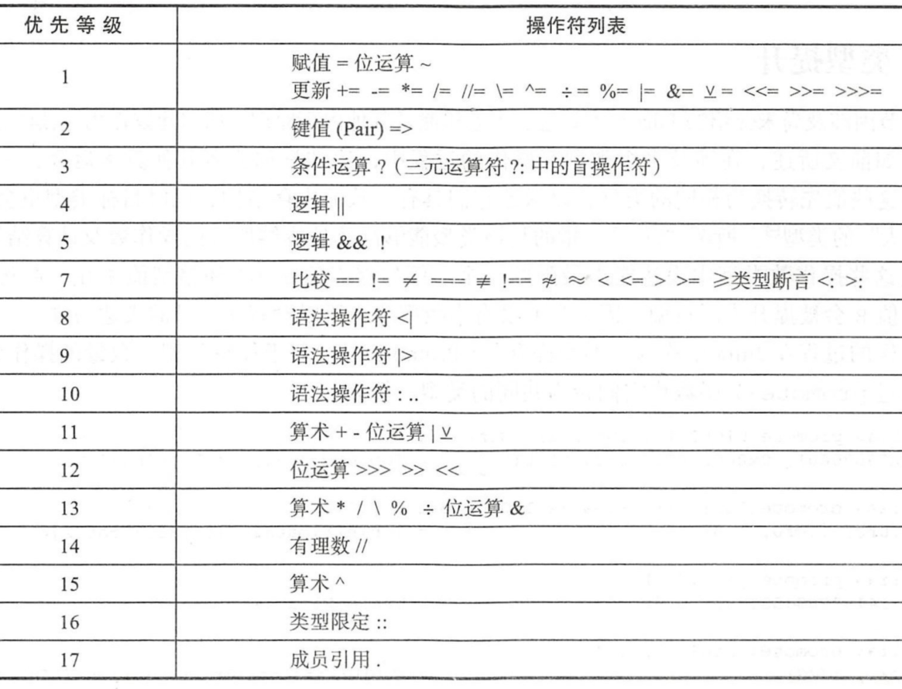

# Julia快速上手

## 0.说明

本文档的目标群体是：1.接触过编程但从未接触过Julia语言；2.觉得编程很难的；3.希望能看懂Julia程序代码的；4.期末大作业需要用程序求解的。因此，这里只会讲解基础的Julia语言规则、规范，并配有简单的例子，至于更深一些的内容，还需另请高就（到这种程度也不是本文档的目标群体了）。所有的程序代码都可以从这里获得。

## 1.安装和启动

[在这里](https://cn.julialang.org/)下载最新的Julia，安装。

这一步很重要：**把Julia添加到环境变量中。**右击“我的电脑”→属性→（左侧菜单栏中）高级系统设置→（弹出了新的对话框）点击环境变量→（新的对话框）下半部分“系统变量”中找到”Path“，双击→”新建“→”浏览“→找到Julia所安装的位置，选择其中名为”bin“的文件夹→确定确定确定

安装VS Code，这个集成开发环境（IDE）很强，强烈推荐使用。之后安装Julia拓展包，就可以在VS Code中使用和执行Julia文件了。

## 2.建立项目

双击Julia.exe，打开的就是Julia的REPL界面。这个界面约等于：问电脑一句它答一句（不信请对它输入1+1敲回车）。如果要编一个长一些的程序，有两种方法：

1. 新建文本文档，编写程序，保存，文件后缀改为 .jl 
2. 在VS Code中新建文件 “文件名.jl”，右边开始编程。

### 2.1 REPL的模式

在Julia的REPL界面，输入“？”可以进入查询模式，有任何关于命令的问题都可以输入问它，通常它会检索最相近的命令，然后给出例子，可以用于基本操作的查询。

在Julia的REPL界面，输入 pwd() ，就可以输出当前工作目录

```julia
julia> pwd()
"C:\\Users\\admin"
```

如果需要切换目录，则在REPL界面中输入“ ; ”，进入shell模式（Julia的REPL环境之一），输入需要切换到的地址即可切换目录。

```Julia
shell> cd E:\\New
E:\New

julia> pwd()
"E:\\New"
```

在Julia的REPL界面中输入“ ] ”进入pkg模式（Julia的REPL环境之一），开头会出现如下前缀

```julia
(@v1.4) pkg>
```

这样就说明成功进入了pkg模式，(@v1.4) 表示当前的环境，默认是总环境。

### 2.2 项目建立与源代码

比较大的程序通常需要建立一个项目进行管理，进入Pkg模式后（键盘输入]），输入如下代码建立项目

```Julia
(@v1.4) pkg>generate Pro
```

这样就建立了一个叫做Pro的项目。项目会有src文件夹（source，表示源代码），其中包括了一个与项目同名的Julia文件，以module开头，这个程序可以理解为源代码（以下统称源代码），也可以说是外部函数/模块，可以用在这个项目总文件夹中的任何程序中，也是它们的主程序包。源代码可以加入各种其他的包，或者编写函数，丰富源代码的功能。在VS Code中打开源代码程序，程序如下：

```Julia
module Pro

greet() = print("Hello World!")		#定义了 greet() 函数，其功能是输出 “Hello world!” 。
#可以在这里继续增添其他功能。

end # module
```

如果需要在Pro的项目文件夹中建立的其他程序中使用源代码，则还需要切换环境。在工作目录为当前项目文件夹时，向Julia的REPL输入如下代码切换环境：

```Julia
julia> pwd()
"E:\\New\\Pro"

(@v1.4) pkg> activate .
 Activating environment at `E:\New\Pro\Project.toml`

(Pro) pkg> 
```

此时就在Pro的项目文件夹中建立了环境，可以看到在pkg模式下，括号中的 (@v1.4) 变成了 (Pro) ，即成功切换了环境。把环境切换在当前文件夹下，那么同文件夹中的程序就可以方便地引用源代码。

在Pro文件夹中新建一个Julia程序，用如下方式可以引用源代码。

```Julia
Pro.greet()
```

此时在REPL的交互界面就会显示如下内容：

```julia
Hello World!
julia>
```

如果在源代码中将需要引用的函数/模块用 export 命令导出，则可以在Pro文件夹中的其他Julia程序中更方便地引用这些函数/模块。源代码的导出代码示例如下：

```julia
module Pro
greet() = println("Hello World!")
export greet						#导出greet函数
end
```

在Pro文件夹中的其他程序中，引用Pro源代码的方式改变了：

```julia
using Pro
greet()
```

这种引用方式的好处在于，当 greet 函数在其他程序中被引用时，在程序开头会显示使用了该程序包，并且在大量引用时，可以减少代码输入量。

**值得注意的是，当源代码执行过后，需要重新启动Julia的REPL界面，否则执行其他引用源代码的程序时会报错。**

除此之外，还会有一个自动生成的项目文件 Project.toml，文件内容如下

```julia
name = "Pro"
uuid = "f282525e-dd7b-48bd-8be0-97bcbc3996b2"
authors = ["Boyang Sheng <summernights@stu.xjtu.edu.cn>"]
version = "0.1.0"
```

UUID是自动生成的（不用管），authors与Git的账户是相连的，version是可以自行修改的（各部分其实都可以自行修改）

此外还有Manifest.toml，这个文件是不可编辑的，它记录了所有被使用的包，包括被使用的包所引用的包也会被记录。比如在源代码中引用了别的程序包，这些程序包的信息就会被记录在这个文件中，通常在上传到Git时我们会把这个文件忽略掉（使用ignore进行该操作）。**按照以上步骤进行操作是不会自动生成这个文件的。**如果在这个环境中添加其他的程序包，这个文件才会自动生成，并且同步更新 Project.toml 文件。

建立项目步骤总结如下：

1. 打开Julia的REPL界面，启用shell模式选择项目建立的位置；
2. 启用pkg模式输入代码创建项目；
3. 打开VS Code编辑项目的源代码；
4. 切换环境，在项目的其他文件中引用源代码。

[参考资料](https://github.com/hyper0x/JuliaBasics/blob/master/book/ch02.md-)

### 2.3 程序包拓展

Julia有很多功能强大的程序包，通过安装，就可以使用了。

安装程序包的速度主要取决于电脑性能和网络状况。在Julia的REPL界面输入如下代码会有相应的功能：

```julia
using Pkg			#使用Pkg功能
Pkg.add("CSV")		#添加CSV程序包
Pkg.status()		#查看当前所有已经安装的程序包
using CSV			#在当前程序中调用CSV程序包
Pkg.rm("CSV")		#删除CSV程序包
```

Julia已经有了很多在官方社区注册的程序包，它们都可以通过以上代码进行增删。可以通过[这个网址](https://juliaobserver.com/)搜索需要的程序包。不同的程序包的具体功能，通常会在该程序包的开源网站或仓库中有说明，一般还会配有例子，不难学习。

## 3.输入和输出

### 3.1 直接输出内容

命令如下：

```julia
print("Hello, ")						#输出后不换行
println("You arelearning Julia now.")	#输出后换行
#二者的区别在于是否输出后换行
print(x)								#输出变量x所代表的值或字符
print(x,"Hello,",:hello)				#持续输出，冒号与引号作用相似
#此外还有 printstyled 命令，可以前往？模式查询
```

### 3.2 读取内容

命令如下：

```julia
read("example.txt", String)		#以字符串的形式读取example.txt中的内容
#String Char Int64 Int32 Float64 Float32 各种变量类型都可以作为读取的格式，注意首字母大写
readline("example.txt")			#读取example.txt文件的第一行
readline()						#读取Julia交互界面的输入内容，会以回车作为输入的结束
#此外还有 read!  readlines  readlink 等命令，可以前往？模式查询
```

## 4.数据类型和运算

### 4.1 常量

程序运行时这个值是不变的，它不占内存。包括了八种类型：整型，浮点型，复数型，有理数型，八进制型，十六进制型，字符常量，字符串常量。

```julia
const e			#e 还有 pi 等是内置的常量，可以直接调用
const x=3		#定义x是一个值为3的常量（后续运算无法更改）
```

### 4.2 变量类型

#### 4.2.1 变量命名

命名有一些限制和规则，如下：

1. 变量名区分大小写，example 和 Example 是两个变量名（通常建议使用小写），可以用下划线分隔单词（不太建议），如example_for_here
2. 类型（Type）和模块（Module）需要首字母大写，分隔单词时不要用下划线而用大写区分，比如：ExampleForModule 而不是 Example_for_module
3. 函数（function）和宏（macro）需要小写，且不可以用下划线
4. 变量名不能和 Julia 中的关键词相同，比如：if, else, while等

在 Julia 的REPL中可以输入希腊字母，它们都有相应的代码和输入格式，即“\name“之后加Tab键即可，具体列表如下（其他的详见[UTF-8希腊字母对应表](https://www.cnblogs.com/Gregg/p/11207089.html)）：

```Julia
\Alpha; \Beta; \Gamma; \Delta; \Epsilon; \Zeta; \Eta; \Theta; \Iota; \Kappa; \Lamda; \Mu; \Nu; \Xi; \Omicron; \Pi; \Rho; \Sigma; \Tau; \Upsilon; \Phi; \Chi; \Psi; \Omega; 
#如果将它们首字母小写，就可以转换为相应的小写希腊字母
```

#### 4.3.2 变量类型

| 名称     | 表示方法                          | 备注                                         |
| -------- | --------------------------------- | -------------------------------------------- |
| 整型     | Int8; Int16; Int32; Int64; Int128 | 它们的区别是位数的不同，Int8最多表示2的8次方 |
| 浮点型   | Float8; Float16; Float32; Float64 |                                              |
| 复数型   | 关键字符 im，如：x=1+2im          |                                              |
| 有理数型 | 关键字符 \\\，如：x=2\\\3         |                                              |
| 字符型   | Char                              | 代表单个字符，常用单引号 ' ' 表示            |
| 字符串型 | String                            | 可以用双引号 " " 表示                        |

```julia
#程序举例
println("Pleas input a number")
x = readline()
y = parse(Int,x)
#parse(需要的变量类型，原变量类型)语句，用于转换不同形式的变量
z = parse(Float16,x)
println("The type of x is ",typeof(x))
#typeof(变量)语句用于查询变量的类型
println("y = ",y,"\n","The type of y is ",typeof(y))
println("z = ",z,"\n","The type of z is ",typeof(z))
#"\n"是手动换行的命令
```

### 4.3 计算

最简单的 算术运算：

```julia
+ ; - ; * ; / ; ^ ; % ; \ 
#分别表示 加 减 乘 除 乘幂 求余 反除
#注意反除时需要连续输入两个 \ ，前一个表示转义，后一个表示反除
```

稍微复杂一点的 赋值运算：表示为 “ A □= B ”，意思就是，B不变，A = A □ B，计算过程中，只有A的值不断地在变化。

```julia
= ; += ; -= ; *= ; /= ; ^= ; %=
```

再难一点的 关系运算：表示为“ A □ B ”，用于判断A与B的大小关系，常与if语句结合进行判断

```julia
#关系运算主要是：A和B一样（==），A和B不一样（!=），A比B大/小（>/<），或者大于等于、小于等于的关系
A == B ; A != B ; A > B ; A < B ; A >= B ; A <= B
```

更难一些的 条件运算：表示为”表达式1 ？ 表达式2 ： 表达式3“，意思是”式1成立吗？成立→执行式2，不成立→执行式3”，**空格不能省略！**

```julia
println("Input a number.")
x = readline()
x1 = parse(Int,x)			#parse(需要的变量类型,原变量) 函数表示，将原变量转化为需要的变量类型
x1 >= prevfloat(5.0) ? println("It is no less than 5.") : println("It is less than 5.")
#注意，这里的“?”和“:”前后都有空格，不能省略！
#prevfloat(x)函数表示比x小一丢丢的前一个数，相应的有nextfloat(x)，可以通过输出命令来查看它的值
```

以及还有一种计算 逻辑运算：

```julia
&& ；|| ; !
#表示 与 或 非 关系，它们可以联立使用，下面的代码就是简单地运用
println("This example is to test whether a number could be exact divised by 2 and 5.")
println("Please input a number")
x = readline()
x1 = parse(Int,x)
if x1 % 2 == 0 && x1 % 5 == 0
	println("Yes, this number can be exact divised by 2 and 5.")
elseif x1 % 2 == 0 || x1 % 5 == 0
	println("This number can be exact divised by 2 or 5.")
else
	println("This number cannot be exact divised by either 2 or 5.")
end
```

计算的优先级别如下（越靠前越优先）：

##### 

## 5.判断和循环

### 5.1 判断语句if & else

（其实在4.3中已经出现过了）非常简单，直接看4.3例子的代码好了

```julia
#=通常的格式：
if 这里至少是一个关系运算的表达式A
	这里是其他的命令
else
	这里是除了A情况之外的情况所需要执行的命令
end		#（不要忘了写end）
如果有多重判断，那就加上elseif，这一层的elseif不需要end结尾，也就是说一个if判断最终只有一个end
=#
println("This example is to test whether a number could be exact divised by 2 and 5.")
println("Please input a number")
x = readline()
x1 = parse(Int,x)
if x1 % 2 == 0 && x1 % 5 == 0
	println("Yes, this number can be exact divised by 2 and 5.")
elseif x1 % 2 == 0 || x1 % 5 == 0
	println("This number can be exact divised by 2 or 5.")
else
	println("This number cannot be exact divised by either 2 or 5.")
end
```

### 5.2 循环结构

请一定分清楚 直到型循环（for循环） 和 当型循环（while循环）。for循环先执行，后判断；while循环先判断，后执行。二者容易出现循环数量不一致的情况，请一定多注意。

#### 5.2.1 for循环

```julia
#=  for循环，表达方式为：
1） for 变量 in 数组
        其他命令
    end
2） for 变量 in range(左边界，右边界，step=步长)
        其他命令
    end

在 "range(左边界，右边界，step=步长)" 命令中，可以将 step = 换成 length = x ，效果为将范围内平均分成x份
=#
for num in range(1,25,length = 5)
    println(num)
end
```

#### 5.2.2 while循环

```julia
#=  while循环，表达方式为
while 表达式
    命令
end
注意，如果有参数需要从while循环外部引入，则需要借助global语句
要跳出循环，则加入break即可
=#
println("Here comes an example of While circle.")
println("Please input a number, then the program will compute its sum of factorial.")
x = readline()
x1 = parse(Int,x)
n = 0		#循环次数
i = 1		#判断i与输入参数之间的大小
j = 0		#计算和的参数
while n < x1
	global x1, n, i, j		#global 将x1，n，i，j等变量引入while循环中
	n += 1
	i = i*n
	j = j + i
end
println("The sum of factorial of ",x1," is ",j)
```


## 6.简单文件操作

## 7.数组和矩阵

### 7.1 

## 8.函数和模块

### 8.1 函数

#### 8.1.1 内置函数

Julia内置的函数主要有 数学函数（包括三角函数）、随机函数、字符（串）函数这三类

数学函数[参见这里](https://www.w3cschool.cn/julia/i26o1jfa.html)，有需要时可以查询；随机函数很好理解，生成随机数，举例如下：

```julia
rand(1:10,3,5)		#生成一个 取值范围是1-10的、包含3行5列的随机数组
randn(1:10,3,5)		#按照正态分布取随机数的值，其他相同
#它们都是浮点数！
```

字符函数常用的有两个，用于转换字符和其对应的Unicode编码，如下：

```julia
Char(80)		#将数字转换为字符，函数首字母大写
Int('P')		#将字符转换为数字，注意这里需要用单引号
```

字符串函数比较复杂，具体如下：

```julia
string = "This is an example."
SubString(string, start, end)
# ↑用于在字符串string中截取一部分内容，start是开始部分，end是结束部分
length(string)			#获取字符串的长度
firstindex(string)		#获取字符串的首个字符
lastindex(string)		#获取字符串的最末字符
occursin(a, string)		#判断字符串a是否在字符串string中，是则返回true
```

#### 8.1.2 自定义函数

自定义函数必须用关键词function开头，直接举例说明：

```julia
function Example(x,y)		#定义了一个叫做Example的函数，并且有两个传入这个函数的参数x和y
    if x > 5
        return(x+y)			#一旦出现return命令，则输出return括号内部的值，跳出函数，回到主程序
    else
        return(nothing)		#这里返回值是空，nothing意味函数没有输出结果
    end
end							#函数最后有end结尾

function example2()			#定义一个叫example2的函数，这个函数没有输入值
    x = 1, y = 2
    x + y
    x - y
end
# ↑这个函数输出值就是最后的表达式x-y的值
```

函数只能在同一个文件中进行调用，或者作为单独的.jl文件保存后，在REPL界面使用include("*.jl")命令调用。

### 8.2 模块

模块可以在不同的文件中进行调用，相当于跨文件的函数，并且模块可以包含多个函数。这一部分在2.2有所提及，举例如下：

```julia
module eg					#定义一个叫eg的模块，这里没有任何括号
	export func1			#输出func1函数
	function func1()
    	println("This is function 1.")
	end
	
	function func2()
    	println("This is function 2.")
	end
end							#模块最后也有end命令！
```

在以上定义的模块中，用export输出了函数func1，并没有输出函数func2，则func1是公开的，而func2是非公开的，区别体现在二者的调用上。在另一个文件中调用func1和func2，分别需要如下命令：

```julia
using eg
func1()
eg.func2()
```

此外，第一行的 using 可以用 import 代替，import 允许修改引入模块中的内容。

通常而言，在项目的src文件夹中，只有一个module和多个function，如果源代码需要很多function支撑，则可以将function单独作为.jl文件保存在src文件夹中，再在module中使用 include 命令使得源代码的module囊括该function的功能。调用方式与上面所写的一致。


## Appendix


