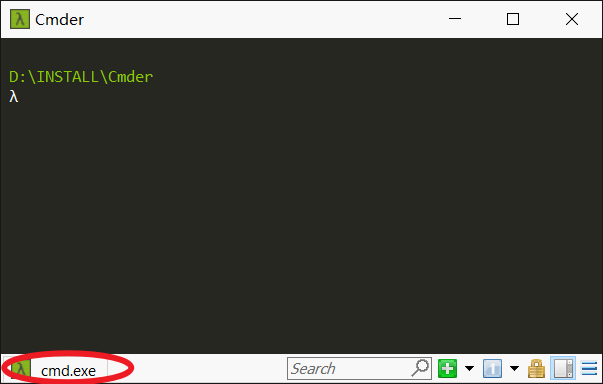
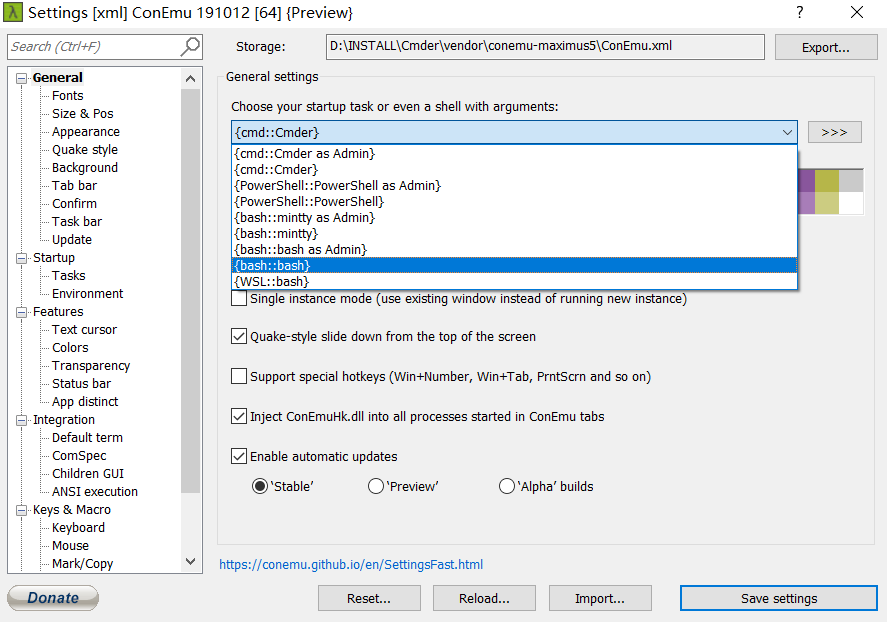
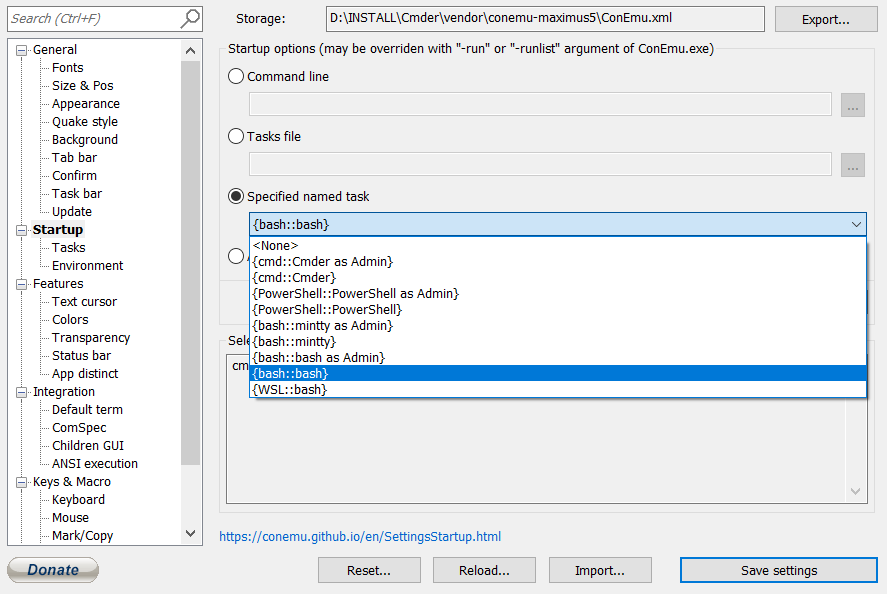

# Cmder快速上手

## 0.说明

​	本文档只是浅层地讨论一下Cmder在IRCRE-Webpage中的应用，并未对Cmder有深入了解。如果对Cmder有更多的需要，还请查询相关文档及说明。

## 1.Cmder的安装与环境配置

​	通过网络搜索下载Cmder比较慢（亲测），因此我将它上传到了网盘，需要安装包请移步以下百度云链接：

> 链接：https://pan.baidu.com/s/1TwGfs0twwN6umaqhN9wUkA 
> 提取码：0414 
> 复制这段内容后打开百度网盘手机App，操作更方便哦

​	下载后可以直接运行Cmder.exe，打开后界面如下：



​	注意左下角红圈所标出的内容，当前Cmder与Windows自带的CMD的功能是一样的，可以将Cmder当做CMD使用。

​	在Cmder中打开设置（快捷键Win+Alt+P），更改shell模式：



​	在左侧选择Startup，同样更改为{bash::bash}，



其他设置（如字体大小等）可以根据个人需要进行调整，此处不再赘述。接下来需要将Cmder添加到环境变量以及鼠标右键菜单。

### 1.1  添加至环境变量

与Python等相似，Cmder也需要将自身添加到环境变量中。具体操作与Python添加到环境变量中相似：

右键我的电脑→属性→（左侧菜单）高级系统设置→（下方）环境变量→系统变量→找到并双击Path→点击浏览并选择Cmder的解压位置→确定

### 1.2  添加到右键快捷菜单中

在**管理员权限**的终端中输入以下内容并敲击回车：

```
Cmder.exe /REGISTER ALL
```

随后关闭窗口并打开资源管理器（或者在桌面）右键单击打开菜单进行确认。

## 2.Cmder在IRCRE-Webpage中的应用

较为详细的使用方式在 IRCRE说明.pdf 中有说明。在此之前需要对Cmder进行测试。首先可以直接输入python，这个命令将会在cmder中打开python，如果可以启动，说明Cmder安装成功，并且可以正常使用了。

之后需要在python中import一个包，即doi2bib的包，输入import命令即可。

## 3.其他参考资料

[Cmder相关介绍/安装/环境变量/用途](https://jingyan.baidu.com/article/63acb44acc855461fcc17ea6.html)

