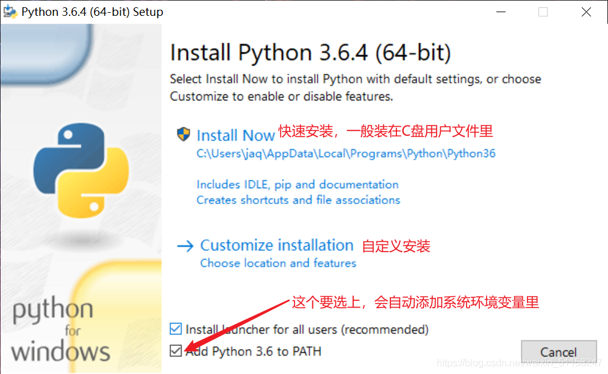
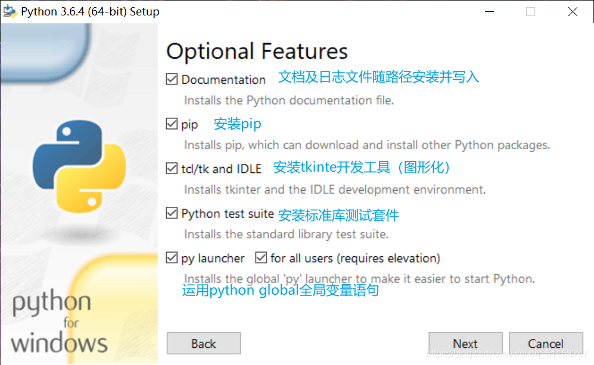
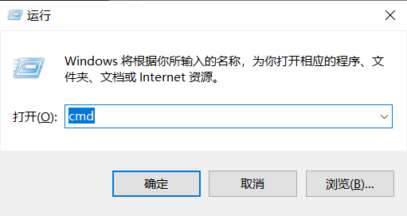
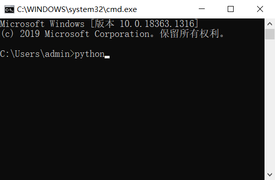
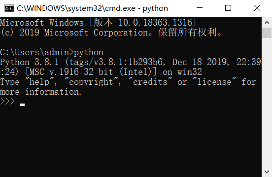

# 

## 0.说明

​	本文档面向0基础的编程新手。通过学习本文档，可以达到懂一点编程的原理、会编写基本的Python程序、能够用Python建立项目。至于后续Python在机器学习、数据分析、人工智能、网络爬虫等方面的应用，是不在本文档的说明范围之内的，到了这个水平也不再属于快速上手的范畴。

## 1.有关编程和Python

### 1.1 我们是如何让机器读懂程序的

​	电子计算机是靠着“通电”“断电”两个状态表示0和1，而我们平时使用的程序（其实Windows等系统也算一个程序）都是在不断调用、读取、修改0和1状态，从而达到完成某个指令（如编写了一个Word文档）的目的。这个指令是在一个程序中运行的，程序是依靠代码运转，而代码是一层层的封装，最终调用0和1的不同状态。要知道的是，计算机只能读取“0”和“1”，所以我们看起来很简单的计算在0和1的世界里是这样的：

```python
0010 0001 0000 0100
0001 0001 0000 0101
0011 0001 0000 0110
0111 0000 0000 0001
```

​	然而我们并不需要靠0和1来编写程序，实际上，在计算机几十年的开发过程中，已经有人将这个**编译器和解释器**的工作做完了，我们编写代码调用这些编译器和解释器，编译器和解释器再将它们翻译成为0和1。（实际上现在的编程语言已经高级很多了，有很多层的编译器和解释器，一层一层调用）

> 编译器：高级语言（我们看得懂）→机器语言（电脑看得懂），只有翻译的过程。输入的是高级语言，经过编译器，得到的是机器语言，最终的程序是以机器语言存储的，直接打开代码出现的是机器语言。
>
> 解释器：高级语言→机器语言，不仅可以翻译，还能执行。对程序中的每个命令都执行这个操作：翻译、执行。输入的是高级语言，经过解释器翻译，再执行命令，最终程序是以高级语言存储的，只不过每次执行的时候都需要先翻译成机器语言，再执行。

​	**算法**是编程中非常重要的思想，或者说算法决定了一个程序的步骤，**是指令/命令的有限序列**，它一定是有一个结果的（不会永远执行）。算法需要有这几个属性：**输入**、**输出**、**有限**、**确定**（算法内所有的步骤都是被精确定义的）、**有效**（是可行的，且计算不需要太多的时间）。创建一个算法通常需要三个步骤：输入、处理、输出，可能存在不需要输入阶段的情况，这种情况下，电脑/机器知道自己要做什么事情（比如编写一个程序计算1-10的自然数的和，机器明确知道自己的任务）。

### 1.2 有关Python

介绍放这里了：[百度百科](https://baike.baidu.com/item/Python/407313?fr=aladdin)，[Python官方](https://www.python.org/)

​	Python有多种解释器，比较著名的有CPython、IPython、PyPy、Jython和IronPython等。

- CPython是Python官方默认的解释器，它是用C语言实现Pyhon解释器。CPython是单纯的解释器，将源代码转化为字节码之后解释执行。

- PyPy，比CPython解释器更加灵活。在程序的运行性能上PyPy将近是CPython解释器执行效率的1至5倍。

- IPython是基于CPython增强了交互。

- Jython是运行在Java平台上的Python解释器。

- IronPython是运行在.Net平台上的Python解释器。

- pycharm可以说是标准的python开发环境，功能最全，唯一的缺点就是启动有点慢。

  Python发展了很多年，拥有了很多拓展包。拓展包的功能很丰富，而且集成度相对比较高，也就是说，某一类功能可以通过调用拓展包来实现（所谓的“调包师”），这个在后续会详细讲。

先从下载安装Python和搭建Python环境开始。

​	首先，[在这里下载Python安装包](https://www.python.org/downloads/)，由于一些奇怪的原因，有一些拓展包不支持最新版的Python，以及最新版的Python有时候会出现不稳定等情况，建议安装3.8.1版本的Python。（上面的链接服务器不在国内，网速可能比较慢，因此推荐使用[国内镜像网站下载](http://npm.taobao.org/mirrors/python/)）

​	安装Python时，不建议安装目录出现中文字符（可能会出现不稳定的问题）。具体如下（[图源链接](https://blog.csdn.net/weixin_51158247/article/details/111306867)）：






​	之后就安装完成了，并且通常情况下，已经将Python添加到系统变量中去了（意思是系统已经承认Python是个编程系统了），检测方法是Win+R打开运行窗口，输入cmd并执行（如下图）



在打开的窗口中输入python，如下图：



​	如果出现如下的内容，说明已经启动了Python，也就是成功安装了Python并完成了系统环境搭建，恭喜你！[如果没出现请看这里](https://blog.csdn.net/weixin_51158247/article/details/111306867)



如果用上面的开发环境，可能会劝退大多数人，所以接下来我们需要一个很屌的开发环境，或者说一个集成了写代码、运行调试代码的平台——Visual Studio Code.

#### 1.2.X Visual Studio Code

[这是官网](https://code.visualstudio.com/)，只不过打开比较慢。

安装过程中以下几个选项建议勾选：


这样安装完成重启后，点击鼠标右键菜单，可以看到“通过Code打开”的选项：


这样可以在资源管理器/文件夹中点击，快速使用VS Code打开这个文件夹。

### 1.3 VS Code中的拓展插件安装

安装好VS Code后，在左侧的“拓展”菜单（Ctrl+Shift+X）中搜索如下几个拓展包：

- Chinese (Simplified) Language Pack For VS Code  →  不用说了，至少看得懂操作界面了（安装完后会提示重启，重启即可）
  
- Python  →  虽然已经安装了Python 3.8.1，但是不在VS Code中安装这个拓展包依然会导致无法编译等问题出现。
  
- Code Runner  →  这个拓展插件可以支持单击鼠标右键执行当前已经保存的代码，不需要再寻找执行键，比较方便，推荐使用。
  

此外VS Code在最开始几次运行的过程中，右下角会有弹出的窗口提示安装相关插件，安装即可。

> 这里建议修改默认字体的大小，打开左下角设置，在搜索设置中搜索 Font Size，主要需要修改的是两项，如下：
> 

### 1.4 Python环境搭建及项目创建

​	以下部分内容来自于[这里](https://blog.csdn.net/weixin_40528417/article/details/81141567?utm_medium=distribute.pc_relevant.none-task-blog-BlogCommendFromMachineLearnPai2-14.control&depth_1-utm_source=distribute.pc_relevant.none-task-blog-BlogCommendFromMachineLearnPai2-14.control)，如果有描述不清楚的内容建议查看。

​	首先，找一个稳定可靠的位置新建文件夹（不建议在文件路径中出现中文字符，有时候莫名其妙的问题可能会是中文字符造成的），之后进入文件夹右键选择“通过Code打开”，在左边资源管理器中选择新建文件：


​	新建文件之后，需要一并补充文件后缀名，新建Python文件的后缀是“.py”，这个文件就是一个没有内容的Python文件了。完成这个操作之后，需要对这个文件夹进行属于VS Code的环境配置，这个配置只对这个文件夹内的所有Python文件生效，只需要执行一次这样的操作（一劳永逸）。具体操作如下：

- 使用Ctrl+Shift+P打开搜索  →  输入“调试”或者“launch”  →  选择“Python文件”，会弹出名为launch.json的文件，修改成如下内容：
  **（注意：中间有pythonpath的位置，选择自己的Python安装的位置！）**

  ```python
  {
      // Use IntelliSense to learn about possible attributes.
      // Hover to view descriptions of existing attributes.
      // For more information, visit: https://go.microsoft.com/fwlink/?linkid=830387
      "version": "0.2.0",
      "configurations": [
          {
              "name": "Python",
              "type": "python",
              "request": "launch",
              "stopOnEntry": false,
              "pythonPath": "D:\\Install\\3.Tools\\Python 3.8.1\\python.exe",
              "program": "${file}",
              "cwd": "${workspaceFolder}",
              "console": "integratedTerminal"
          },
          {
              "name": "Python: Attach",
              "type": "python",
              "request": "attach",
              "port": 5678,
              "host": "localhost"
          },
          {
              "name": "Python: Module",
              "type": "python",
              "request": "launch",
              "stopOnEntry": false,
              "pythonPath": "D:\\Install\\3.Tools\\Python 3.8.1",
              "module": "enter-your-module-name-here",
              "console": "integratedTerminal"
          },
          {
              "name": "Python: Django",
              "type": "python",
              "request": "launch",
              "stopOnEntry": false,
              "pythonPath": "D:\\Install\\3.Tools\\Python 3.8.1",
              "program": "${workspaceFolder}/manage.py",
              "console": "integratedTerminal",
              "args": [
                  "runserver",
                  "--noreload",
                  "--nothreading"
              ],
              "django": true
          },
          {
              "name": "Python: Flask",
              "type": "python",
              "request": "launch",
              "stopOnEntry": false,
              "pythonPath": "D:\\Install\\3.Tools\\Python 3.8.1",
              "module": "flask",
              "env": {
                  "FLASK_APP": "app.py"
              },
              "args": [
                  "run",
                  "--no-debugger",
                  "--no-reload"
              ],
              "jinja": true
          },
          {
              "name": "Python: Current File (External Terminal)",
              "type": "python",
              "request": "launch",
              "stopOnEntry": false,
              "pythonPath": "D:\\Install\\3.Tools\\Python 3.8.1",
              "program": "${file}",
              "console": "externalTerminal"
          }
      ]
  }
  ```

- 使用Ctrl+Shift+P打开搜索  →  输入“tasks”，选择“配置任务”  →  选择“使用模板创建tasks.json文件”  →  将弹出的文件内容修改如下：

  ```python
  {
      "version": "2.0.0",
      "tasks": [
          {
              "label": "python3",
              "type": "shell",
              "command": "/usr/bin/python3",
              "args": ["${file}"]
          }
      ]
  }
  ```

- 完成以上两个步骤之后，在左侧的资源管理器中会出现新的文件，如下：
  

这样就完成了Python在VS Code中的配置。

## 2.教机器“认字”和“说话”

​	编程过程中最基础的就是交互，编写的程序作为输入，执行过程作为处理，得到的结果显示或输出的文件作为输出，这一节将介绍基础的交互、基本的变量类型和基本的Python命令。

​	请记住，**Python文件是 .py 结尾的**。

### 2.0 Python认识什么字

​	所有用Python处理的东西，都是用数字或字符表示的。通常称它们为**变量**（这里不展开讲变量储存的原理，暂时没有了解的必要），Python的变量一共有五种类型：数字（number）、字符串（string）、列表（list）、元组（tuple）、字典（dictionary）。这里先介绍最常用的数字和字符串，后续的部分遇到了再展开说明。

直接看例子：

```python
#这里是数字的类型
x = 3				#定义了一个变量x，它的值为3，是个整型变量
print(type(x))		#用type(?)命令查看变量?的类型，并用print命令输出
y = 3.14			#定义了一个变量y，它的值为3.14，是个浮点型变量
print(type(y))
y1 = 3.14e5			#定义了一个变量y1，它的值是3.14×10^5，也用浮点型变量表示
y2 = 3.14e-5		#定义了一个变量y2，它的值是3.14×10^-5，也用浮点型变量表示
print(y1, y2)
z = complex(3,14)	#定义了一个变量z，是个复数型变量，实部是3，虚部是14
print(type(z))
del x				#del函数删除掉了x的所代表的值，这时候再用print命令输出会报错

```

```python
#这里是字符串类型
a = 'Hey Jude,'				#单引号和双引号作用相同，引号内部的内容都是字符串a所代表的，相当于给这一串字符起了个名字叫a
b = "don't be afraid."
c = '''Take a sad song
then go to get her.
Remember to let her in to your hear.
Then you can start to make it better.
'''
#三个单引号所括起来的内容可以在其中任意换行而不会中断，也可以在三个单引号内使用单引号或者双引号，作为引号的引号
print(a,b)
print(c)
```

值得注意的是，和变量相对的是**常量**，常量在被定义/声明之后是不会改变的，可惜，**Python中是没有常量的**。如果我们需要在Python中使用常量的话，可以定义一个变量，只要不改变变量的值，就可以视它为常量。

> 声明一个变量：声明一个变量会占用内存（RAM）的一部分空间，相当于给变量留个位置，声明的作用是使得编译器和解释器可以知道一个变量需要多大的空间。


### 2.1 熟悉的“Hello World!”——print命令

代码举例：

```python
print("Hello Wrold!")
#上面的语句就是标准的输出字符串，或者说双引号中的内容就是输出显示的内容
#通常会用注释符号 井号 来解释代码的作用，这也是编程的一个好习惯，编程时用注释将代码的意义写清楚，一方面可以在寻找程序bug时提供便利，另一方面可以方便下次查看了解代码的含义或逻辑
```

print函数是作为输出最常见的一种方式，代码运行的结果会直接显示在终端中作为输出。之后会介绍作为文件存储的输出方式。

来看下面的代码例子：

```python
print("Good","to","see","you.")					#如果不定义分隔符，Python会自动添加空格
print("Good", "to", "see", "you.",sep = "*")		#通过sep命令可以自定义分隔符
print("Good", "to", "see", "you.",sep = "")

a = 'Good to see you'
print(a)			#print可以直接输出a所代表的内容
a = 3
print(a)

#具有特殊作用的格式化输出符号
print("Good","\t","to","\t","see","\t","you.")	#\t 表示间隔一个制表位（相当于点按一次Tab键）输出，可以对齐，强迫症福音
print("Good","\n","to","\n","see","\n","you.")	#\n 表示换行输出
```

### 2.2 比较和判断——布尔表达式/与或非

​	先说布尔表达式。**布尔表达式的结果是 true 或者 false.** 举例如下：

```python
#布尔表达式的格式是
#表达式1 比较运算符 表达式2
#表达式的形式可以是数字、变量，还有表达式
x >= 3		#表示x大于等于3吗？如果x确实大于等于三，则这个式子的结果就是true

#举个详细的例子
a = 2
b = 3			#给a和b分别赋值2和3
c = a >= b		#c是布尔表达式(a>=b)的值，即c只能是true或者false
print(c)		#输出c的结果

#其他的比较运算符
a == b				#a和b相等吗？相等，输出值/返回值就是true
a != b				#a和b不相等吗？不相等，输出值/返回值就是true
a > b; a < b		#a大于/小于b吗？
a >= b; a <= b		#a大于等于/小于等于b吗？
```

​	有了以上的表达关系，我们就可以进行更深更复杂的表达，也就是与、或、非的表达，此时至少需要有两个表达式。（与、或、非的判定结果不再赘述）

```python
#需要进行与、或、非的判定的布尔表达式结构还是一样的
#表达式1  逻辑运算符（与或非） 表达式2

#举个例子
a = 5
b = 8
c = (a > 2) and (b > a)		#只有a>2且b>a两个式子同时成立，c的值才为真
#这里的括号不是必要的，只是为了提高可读性

#或的表达：
c = (a > 2) or (b > a)		#a>2且b>a两个式子有一个成立，c的值就为真
#非的表达：
c = (a > 2) not (b > a)		#a>2且b>a两个式子都不成立，c的值才为真
```

​	有了以上两种表达，就可以写出如下复杂的表达了，这里关键的问题在于计算机处理这些运算的顺序，在Python中（大多数的编程语言也是这样），计算顺序的优先级如下：
$$
算数运算>比较和从属运算>逻辑运算
$$

> 算术运算中，最先计算的是乘幂(用\**表示)，然后是乘除运算，最后是加减，有括号先算括号。这里与我们的在数学上的认知是一致的。
>
> 比较运算在上文有提到过；从属运算在后面会有举例，简单来说就是某个元素在不在某个集合中，在就返回true.
>
> 逻辑运算的优先级最低，也就是最后运算。

```python
#长难句练习
a = 5, b = 2, c = 7, d = -3
(3*a + b/47 - c*b/a > 23) and (b != 2)
#求上面这个表达式是true还是false
```

​	这里补充一下从属运算，主要有两种具体的表达，举例如下：

```python
#in 表示某个元素在指定序列中吗，如果存在，则返回true
x = 6
y = x in [3,5,8,9]		#意思是，x在序列[3,5,8,9]中吗？如果在，y的值就是true
print(y)				#输出y的值，true或者false
#这里[3,5,8,9]是一个简单的列表表达方式，以后会对列表这样的变量类型详细介绍
#以上的表达式可以展开，用与或非关系改写
x = 6
y = (x == 3) or (x == 5) or (x == 8) or (x == 9)
#可以看到，用从属运算可以使得其他表达变得简单

#再举一个例子
a = s in 'science'		#意思是，s在不在字符串science中存在呢？如果在，那么a的值就是true
print(a)

#not in 这个表达与 in 的意思刚好相反，表示某个元素在指定序列中吗，如果不在，返回true
```

### 2.3 if/else结构

​	这是代码中最常见的一种结构，如果……就执行A命令，否则执行B命令，具体的格式如下：

```python
#格式举例
a = 1
if a >= 0:		#注意，这里一定要有冒号。在VS Code中输入冒号换行后会自动缩进
    x = 3
    print(a+x)
else:			#这里也必须有冒号
    x = 0
    print(a*x)
```

​	这里说明一点，有关Python中的缩进（即点按一次tab，相当于4个空格）。Python代码被戏称为“游标卡尺”，原因也在这里，如刚刚提及的if结构，在if内部的命令必须具有同样的缩进（这里是一个缩进），否则就不会被认为是if内的命令而报错；同样在else语句中也需要同样的缩进，否则也会报错。此外，在while和for循环中也需要相应的缩进。

​	在if结构中，我们可以多层嵌套，if里面套if；或者用elif命令（else if的简写）进行多个分支，比如下面的代码：

```python
#用电脑评判你的成绩
print("请输入你的成绩")
x = int(input())
#↑这里有两个命令，input()命令（实际上是个函数）用于读取一个合法的输入，并转化为string；而int()函数，是将括号内的内容转化为整型变量。这一句命令中使用了嵌套，把input()函数嵌套在了int()函数中，有点类似复合函数。
if x <= 60:
    print("你的成绩不及格")
elif 60 < x <= 80:
    print("你的成绩还凑合")
elif 80 < x <= 100:
    print("你的成绩不错嘛")
    if x == 100:
        print("学霸你太厉害啦")
else:
    print("你成绩是假的吧")
```

### 2.4 

## 附录

### A1  常用的函数和命令

```

```

### A2  常用的算法举例

#### A2.1  交换两个变量所代表的值

​	在交换两个变量所代表的值时，通常用赋值语句就可以了，问题在于计算机存储变量所代表的值是有先后顺序的，举个例子：

```python
a = 1, b = 2
#如果直接交换a和b的值，命令如下：
a = b 	#（1）
b = a	#（2）
print(a,b)
#这样执行的结果是，在执行（1）的时候，a=b=2，把b的值给了a；而在执行（2）的时候，此时这一行中a的值已经变成了2而不是1，因此最终这一句执行的结果是b=a=2。这种方式不能完成两个变量值的交换
```

​	此时，我们通过引入中间变量，就能够解决以上问题。

```python
a = 1, b = 2
temp = a
a = b
b = temp
print(a,b)
```

​	这种变量交换在while循环和for循环结构中比较常见，建议熟练掌握。

​	题外话：某些软件的安装目录中会存在temp这个文件夹，其实也是有类似的思想在这里，temp本意是临时雇员，引申在此表示临时的文件，在编程中常用temp作为中间变量的变量名。

#### A2.2  冒泡排序

​	有一列数字